# **Gift Nook**
  

[View the live website here](https://gift-nook-cae3a727fe6e.herokuapp.com/)

</br>  

Welcome to the Gift Nook website!
Gift Nook is an e-commerce website that sells bespoke gifts (handmade and personalised). It features an authentication functionality powered by Allauth and a payment functionality powered by Stripe.  These allow users to purchase products safely and securely via the website.  

Please note that this website is created for Milestone Project 4 in Code Institute's Diploma in Full Stack Software Development. The requirements are to produce a full-stack website, using HTML, CSS, JavaScript, Django+Python, relational database, stripe payments, and other additional libraries as needed. 

<br/>  

## **Table of Contents** 
---------

<br/>  

## **UX DEVELOPMENT PLANE**   
### **A. Strategy Plane**  
#### **Project Goals**   
The primary goal of this project is to create an e-commerce website that a fully-functioning e-commerce platform that is visually pleasing and intuative to a first-time user. The website has basic functionalities that are expected in an e-commerce website (such as sign up/login, ability to purchase items, and payments transactions), but also to ensure that users have a great experience and interaction within the site through additional functionalities such as writing product reviews and reading blogs.

#### **User Goals**  
The user is looking for:
- An online store/ website that is straightforward and intuitive to use, easy to navigate whilst purchasing products. 
- An online store/ website which has additional activities and engagement whilst browsing prodcuts.  

The target user for this site is:
- Adults, between 18 - 40
- Thoughful, sentimental people
- People who enjoy the convenience of using technology and social media


#### **Site Owner Goals**  
The site owner is looking to:
- Make money by providing products (and services) to the users. 
- Manage products on the website.

#### **User Stories** 
As a shopper I want to be able to:  
   1. Quickly identify what products/services the site sells.  
   2. Quickly identify shipping costs.   
   3. Search for a product.   
   4. Identify a glimpse of the most popular products.   
   5. View all products, and easily navigate between categories.  
   6. Sort products by price.  
   7. View the individual product's page and read the relevant information.  
   8. Read a product's review.  
   9. Easily add products to a shopping bag.
   10. View the shopping bag with products added to it.  
   11. Manage the shopping bag by removing unwanted products.  
   12. Check out and easily enter my payment information.  
   13. Feel my personal and payment information is safe and secure.  
   14. View an order confirmation after purchasing.  
   15. Receive an email confirmation after purchase.  
   16. Read relevant articles/ blogs.   
   17. Easily navigate within the site, through Navigation Bar and Footer.  
   18. Easily register for an account.  
   19. Find the FAQ section for my questions.  
   20. Contact the shop via a contact form.     

As a registered user/ shopper, I want to be able to:
   1. Access all functionalities that an unregistered shopper can do.  
   2. Easily log in or log out.   
   3. Easily recover my password if forgotten.  
   4. Receive an email confirmation after registering.  
   5. Have a personalized user profile where I can see my order history and change my information.  
   6. Review products that I have purchased before.  
   7. Edit and delete my reviews.  
   8.  
   9. 
   10. 

As an admin and store management, I want to be able to:
   1. Add a product.  
   2. Edit or update a product.  
   3. Delete a product.  

[Back to top &uarr;](https://github.com/lisaloudness/gift_nook)  

<br/>

### **B. Scope Plane**  
Based on all goals and user stories, a scope was defined for the site with room for future improvements.  

#### **Functional Requirements**   
The unregistered users will be able to:  
- Sign up to the site by providing the username, email, and password.    
- View all products and sort them by price.  
- Search for products.  
- View the product's detail.  
- Add products to the shopping bag.  
- Update and remove items in the shopping bag.  
- Checkout and make a payment.  
- Receive an email confirmation of the transaction.    

The registered users will be able to:  
- Do all things that unregistered users are able to do.   
- Log in to the site by providing a username and password.  
- View the profile page.  
- Update delivery/contact information on their profile page.  
- View order history on their profile page.  
- Write reviews for products that they have purchased.  
- Edit those reviews.  
- Delete those reviews.

The admin/ site owners will be able to:
- Have all functionalities as a registered user.  
- Add a product to the site.  
- Edit or update a product.  
- Delete a product.  

#### **Non-functional Requirements**  
Users will be able to:  
- View articles/ blogs about gifts and occasions.  
- View the FAQ page to find answers to their questions.  
- Send a message to the store via contact form.  
- Navigate easily and intuitively throughout the site.

[Back to top &uarr;](https://github.com/lisaloudness/gift_nook) 

<br/>  

### **C. Structure Plane**  
The website was organized in a Hierarchical Tree Structure that ensures the user can navigate easily and intuitively. Below is the website workflow (which was designed using [Creately](https://creately.com/)).  

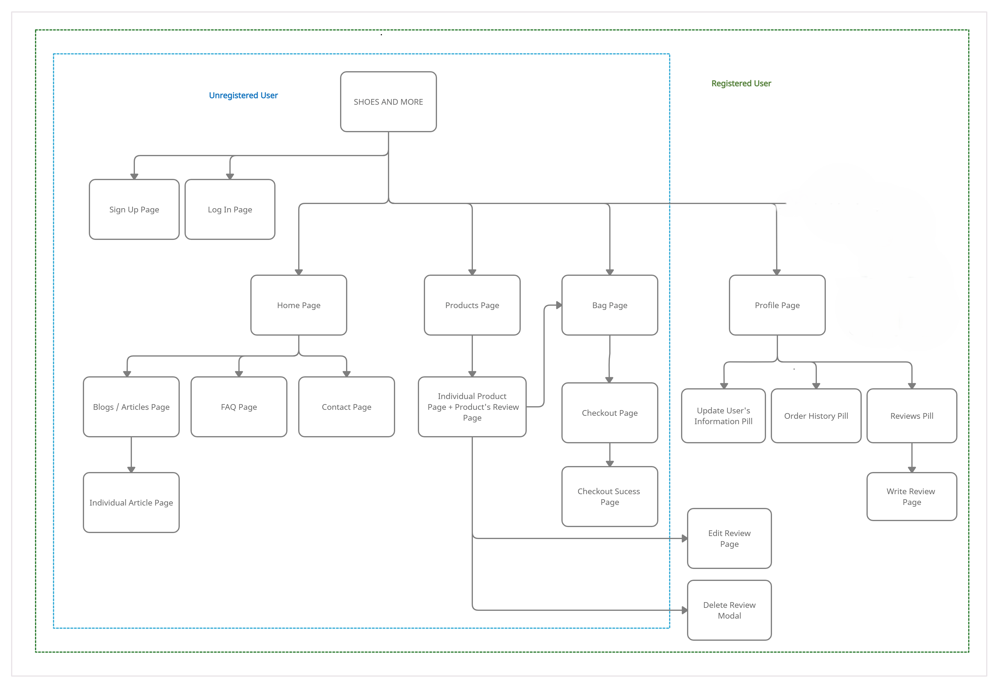   
There's a clear page access separation between unregistered users and registered users. While unregistered users can still purchase products and receive the confirmation via email, they are not able to:  
- View their order history  
- Give reviews (and edit or delete their reviews accordingly)

Those features mentioned are available for registered users.  

[Back to top &uarr;](https://github.com/lisaloudness/gift_nook)  

<br/>

### **D. Skeleton Plane**  
Wireframes were created using [Balsamiq](https://www.balsamiq.com) to design the navigation and interface of the website. The wireframes were created only for desktops.  

- [Wireframe for Home page](media/readme/home.png) 
- [Wireframe for Products page](media/reademe/all_product_search.png)  
- [Wireframe for Individual Product page](media/readme/Product_detail.png)
- [Wireframe for FAQ page](media/readme/faq.png)
- [Wireframe for Sign Up page](media/readme/signup.png)

#### **Color Scheme**  
The overall color theme of the website was natural earthy colors, which have relaxed and comforting influences and encourage feelings of warmth and calmness. Using [Coolors](https://coolors.co), I started with pink (RGB 235, 150, 209) and purple (RGB 180, 10, 140) , and generated two more colors that compliment them both - the results were a mulberry (RGB 178, 94, 146) & magenta (RGB 192, 101, 165) . I also found a hero image that fits the overall theme and colors accordingly [Hero Image](media/gift.jpg "Hero image").   
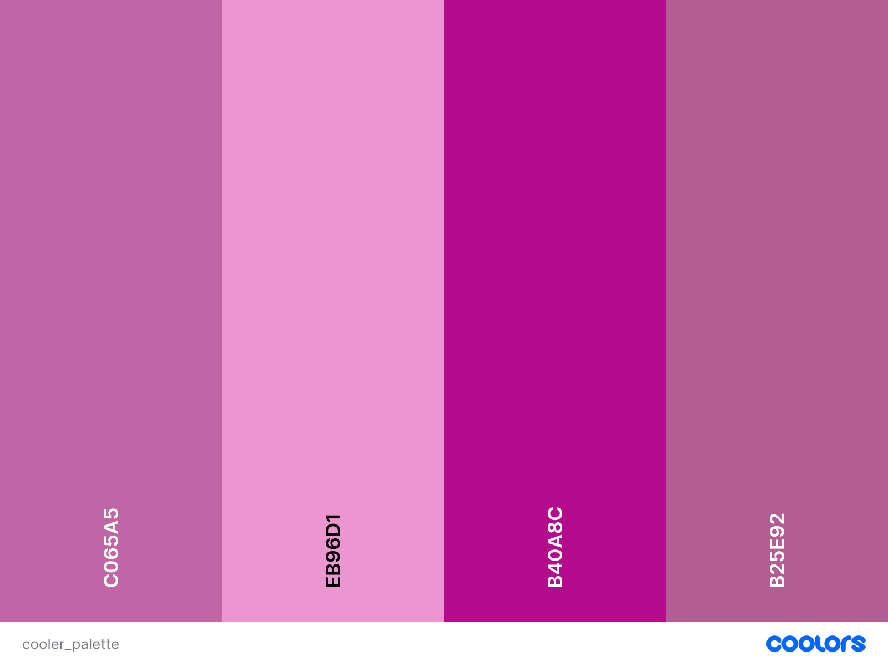  

#### **Typography**  
All of the fonts were sourced from [Google Fonts](https://fonts.google.com).   
- Main font: Poppins   
   Poppins is a geometric sans-serif font, used as the main font, for all paragraphs and buttons. Poppins was chosen because it has a modern and clean style.  
- Secondary font: Sans Serif Display    
   DM Serif Display is a serif font, used as the headers font on the Home page, in order to contrast them with the serif font.

[Back to top &uarr;](https://github.com/lisaloudness/gift_nook)   

<br/>

#### **MPV**  
While I relied heavily on the Boutique Ado walkthrough for the project MPV, the final website had added features:  
- Reviews feature - user able to read product reviews and leave reviews.
- Newsletter - user able to submit email address to receive Gift Nook newsletter
- Blogs
- Advanced interactive footer 


[Back to top &uarr;](https://github.com/lisaloudness/gift_nook) 
<br/>  

## **DATABASE DESIGN**    

The database schema was designed using [dbdiagram.io](https://dbdiagram.io/home). The database was first managed using SQLite during the development process, then Postgres in production with Heroku.   
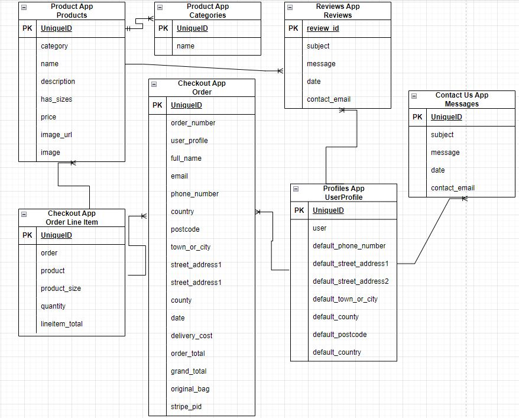  

- **Category model**   
   - Stores category name for a product. The categories, in this case are Him & Her
   - Name field: the name used for database purposes.  
   - Friendly_name field: the name used for display.  

- **Subcategory model**   
   - Stores subcategory name for a product. The subcategories in the database are jewellery for her and jewellery for him 
   - The Category model and Subcategory model have no relationship. I decided not to define a relationship/ pairing between them to make it more flexible. Both are fully independent of each other.  
   - Name field: the name used for database purposes.  
   - Friendly_name field: the name used for display.  
   
- **Product model**   
   - Stores detailed information about a product.  
   - Category field: the category of the product, a foreign key from the Category model.  
   - Subcategory field: the subcategory of the product, a foreign key from the Subcategory model.   
   - Name field: the name of the product, a required field.
   - Price: the price of the product, a required field.  
   - Rating: the rating of the product. Each product has an initial rating value given by the retailer based on its quality from the manufacturer.
   - Image: the image of the product.  
   - Total_purchased: the quantity purchased for this product. The initial (default) value is 0. Each time a user purchases the product, the value also adds up.   

- **User model**    
   - Stores registration information of a user, the model was created as one of the components of Django's authentication system (more information on this, see [django.contrib.auth](https://docs.djangoproject.com/en/4.0/ref/contrib/auth/)). The fields include (but are not limited to) username, email, and password.  

- **Order model**  
   - Stores all information related to a successfully placed order.  
   - Order_number field: a unique order number generated automatically using UUID.  
   - User_profile field: the user that ordered, a foreign key from the UserProfile model (if the user is registered).  
   - Full_name field: the full name of the buyer.  
   - Email field: the email address of the buyer.  
   - Phone_number: the phone number of the buyer.  
   - Street_address1: the first line of street address of the buyer.  
   - Street_address2: the second line of the street address of the buyer.  
   - Town_or_city: the town or city name of the buyer.  
   - Postcode: the postcode of the buyer.  
   - Country: the country of the buyer.  
   - Date: the date of purchase.  
   - Delivery_cost: the delivery cost of the transaction.  
   - Order_total: the total price of the order (the total quantity times individual product price).  
   - Grand_total: the order_total + delivery_cost.  
   - Original_bag: a JSON object of the products that were in the bag.  
   - Stripe_pid: a payment intent id from the stripe for a successful order.  

- **OrderLineItem model**  
   - Stores order details of a product that has been purchased.  
   - Product field: the product ordered, a foreign key from the Product model.  
   - Order field: the order number for this product ordered, a foreign key from the Order model.  
   - Product_size field: the size of the product ordered.  
   - Quantity field: the quantity of the product ordered.  
   - Lineitem_total field: the quantity times the individual product price.    

- **UserProfile model**   
   - Stores user's address information for registered user.  
   - User field: the user itself, a foreign key from the User model.  
   - Default_phone_number field: the phone number of the user.  
   - Default_street_address1 field: the first line of the street address of the user.  
   - Default_street_address2 field: the second line of the street address of the user.  
   - Default_town_or_city field: the town or city name of the user.  
   - Default_postcode field: the postcode of the user.  
   - Default_country field: the country of the user.    

- **Review model**   
   - Stores user's review of products that the user had previously purchased.  
   - Product field: the reviewed product, a foreign key from the Product model.  
   - User field: the user itself, a foreign key from UserProfile.
   - Review_text: the review that the user gave for the product.  
   - Date: the date it was created.  

- **Blog model**   
   - Stores articles/ blogs for the website.  
   - Image field: the image for the article.   
   - Author field: the author of the article, a foreign key from the User model.  
   - Title field: the title for the article.  
   - Paragraph1: the first paragraph of the article.  
   - Paragraph2: the second paragraph of the article.  
   - Paragraph3: the third paragraph of the article.  
   - Created_on: the data it was created.  
  

- **ContactForm model**  
  - Stores the contact form filled by the user.  
  - Name field: the name of the user.  
  - Email field: the email of the user.  
  - Product field: user manually selects product to review from dropwdown list.  
  - Order_number: the order number if the user has it. Filled manually by the user.  
  - Message: the message in the form.  
  - Date: the date it was sent.    

[Back to top &uarr;](https://github.com/lisaloudness/gift_nook) 
<br/>

## **FEATURES**  
### **A. General Design Features**  
- **Fully responsive** - Each page of the site is fully responsive on all device sizes (with a minimum dimension of 320px or an iPhone 4/5) and features intuitive navigational buttons.  

- **Navbar** (on all pages)   
   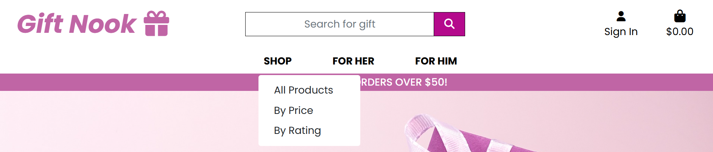   

   - The Navbar is responsive and turns to a hamburger menu on a smaller device. It is also sticky, thus it follows along when the user scrolls down, so the user can easily navigate the site without scrolling back to the top.  
   - The logo is placed at the top left of the Navbar and links back to the Home page.  
   - A search box is positioned center of the Navbar, creating a symmetrical visual between left and right and thus providing the ease of searching a keyword from the each page of the site.   
   - For unregistered users, the Sign In buttons are visible right away, conventionally placed at the top-right of the page. It's a dropdown link that will give options to Register or log in. After the user successfully logged in, the previously Sign In button turns into a My Account dropdown button, which provides the links to My Profile and Log Out.  
   - Shopping Bag link is situated right on the Navbar to give quick access from any page the user is currently at.   
   - There are 6 nav-links to navigate between products categories and subcategories - Shop, All Her, All Him.  
   - A sales banner about free delivery is placed right below the Navbar and also displayed on all pages.  

- **Footer** (on all pages)  
   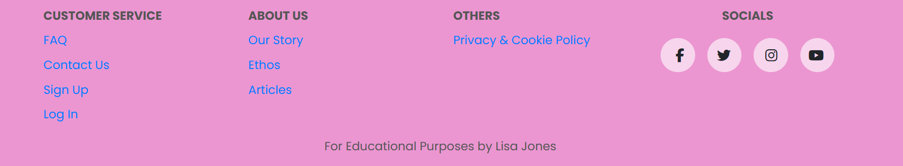 
   The Footer is a bold contrast to the Navbar and provides all navigation links, the social media links of the store as well (that opens in a new tab), and the logo that leads back to the Home page. Here we also have links to the Articles, the FAQ page, and the Contact page. Although these three pages are important, they are not the main pages of the site.  Therefore the links to these pages are only available on the footer, which can be found at the bottom of every page nevertheless.  

- **Toast message**   
Toast messages provide the user the necessary feedback on their activities whether it's successfully executed or not. The toast messages are color-coded: red for error messages, blue for info/ alert messages, yellow for warning messages, and green for success messages. Users will get a success toast the most, for example when users add a product to the shopping bag, they will get a success toast message with a bag display. When users for example add a product to their favorites list, they will get a success toast message without a bag display. Below are the examples of success toast messages (without the bag and with the bag display).   
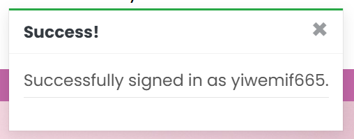
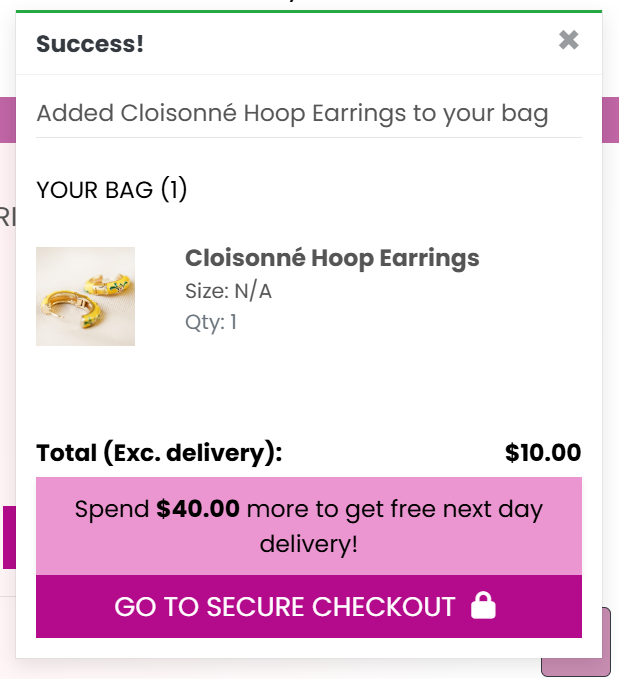   

- **Error Pages**  
Error pages for 403, 404, and 500 errors were created to ensure a great user experience even when the user encounters an error. Users can be informed of the error and can easily navigate back to the homepage.


### **B. Page Features**  
#### **1. Home Page**  
[See the image of the Homepage here](media/readme/home_mob.png)  
- The hero-image covers 100% of the viewport height and width, with an impactful heading to give the user a great first impression. 
- Users are prompted to click the "Shop Now" button to enter the platform.
#### **2. Products Page**  
[See the image of Products page here](media/readme/products_mob.png)     
- The result of products displayed can also be sorted by price (lowest to highest and highest to lowest)..  
- The products are displayed in 4 columns on a large screen, 3 columns on a medium screen, and 1 columns on a small screen.   
- A back-to-top button is fixed positioned on the right side of the screen.  

#### **3. Individual Product Page**  
[See the image of Individual Product page here](media/readme/productdetail_mob.png)  
  
- The page features the product's image, name, price, description and reviews at the bottom of the page.  
- On the bottom of the page users can read a detailed description of the product and read any reviews. Registered users can also leave reviews here too.
- Users can add the product to their shopping bag by choosing the quantity and then click Add to Bag button.
- Under the product information, there's a review section that lists all the reviews for the product. If a user has written a review for the product before, the option to edit will appear below. A registered user is able to edit or delete their own review.   
[See the image of Review here](media/readme/read_review.png)
   

#### **4. Bag Page**  
[See the image of Bag page here](media/readme/bag_page.png)  
- The Bag page features all products that the user has been added to the shopping bag, and the total price that the user has to pay (if the user decides to continue).  
- It displays the products' information such as product's image, name, price and quantity of choice.  
- A trash icon is placed on each product's row, which indicates that users can use this button to remove the specified product from their bag.  
- The subtotal column informs users of the product's price times the quantity. If the user changes the quantity, the subtotal changes accordingly.  
- The total price, the delivery price, and the total are separated in a box, to gain the user's attention on what the next action is. A CTA button to checkout and visual information of the accepted method of payments are placed in the box as well.  
- If the user decides to browse for more products, a Keep Shopping button is positioned below the total box as a secondary option.   

#### **5. Checkout Page**  
[See the image of Checkout page here](media/readme/checkout_mob.png)  
- The Checkout page features the checkout form to process the transaction and the order information.  
- The Checkout form is divided into 3 sections: Details (user's full name and email), Delivery (user's delivery address), and Payment (user's card detail).  
- The order information is filled with a summary of all products from the Bag page, along with the total. CTA buttons are present inside the box for the user to pay and therefore complete the order, or go back to Adjust bag as a secondary option.  

#### **6. Checkout Success Page**   
[See the image of Checkout Sucess page here](media/readme/checkout_success.png)  
- The Checkout Success page features the summary of order transactions that had just been successfully processed, right after the user proceeds to complete the order on the Checkout page.  
- Users can see the Order information, items list, delivery address, and billing information.
- Registered users can also find this summary of orders on their Profile page.  

#### **7. Profile Page**  
[See the image of Profile page - My Information here](media/readme/profile_mob.png)  
- The Profile page features two pill sections - Delivery info and Purchase history.
- In the delivery section, users can update their delivery information. This information will pre-populate the Checkout form for future transactions so that registered users don't have to fill it out all over again. They just have to fill in the payment information.   
- By changing the input fields and clicking the Update Information button, the delivery information is updated in the database.
- Users can view all their order history, sorted by order date (from the earliest to the latest).  
- Each order number can be clicked, and it will lead to the Checkout Success page of the order, so that user can see the detail information of that particular order.  

#### **8. Add/ Edit Review Page**  
[See the image of Add/ Edit Review page here](media/readme/leave_review.png)  
- The Add Review page features a form to submit reviews for a specified product. 
- To submit the rating and review, a Submit Review button is placed below the form. There's also a Cancel button which will bring users back to their profile (review section).  
- After the review is submitted, users are directed back to their profile (review section) as well, to encourage users to review more products.  
- Even though there are two separate templates each for Add Review page and Edit Review page, the display and layout are exactly the same between the two. The only difference is, on the Edit Review page, the rating input and review text area are already prepopulated with the existing rating and review from the user.  
- As mentioned above on the Individual Product page, user can edit their review by accessing the Individual Product page first, finding the review, and then clicking the Edit button.  

#### **11. Articles Page**  
[See the image of Articles page here](media/readme/articles_mob.png)  
- The Articles page features all relevant articles or blogs about gifts and occasions. This provides better customer experiences besides basic purchasing functionality and hopefully will increase users' engagement with the store.   
- All articles are featured in a card-like display, with an image, a title, a small part of the article, and a Read the article link that will bring the user to the Individual Article page.   

#### **12. Individual Article Page**  
[See the image of Articles page here](media/readme/article.png)  
- The Individual Article page features the article itself, the image, the title, and the date created.   
- Read more articles button is placed on the bottom-center of the page to bring users back to the Articles page.  

#### **13. FAQ Page**  
[See the image of FAQ page here](media/readme/faq_mob.png)  
- The FAQ page features frequently asked questions about payment, order, return policy, etc. Users can access this page by clicking the FAQ link on the footer.  
- If users can't find their answers on this page, they are invited to contact the store directly by clicking the Go to Contact Page button placed on the bottom-center of the page.  

#### **14. Contact Page**  
[See the image of Contact page here](media/readme/contact_mob.png)  
- The Contact Page features information on how to contact the store. It provides a name, email address, and a contact form.  
- Users can fill out the contact form and submit it. The server side will store it in the database so the store admin can see and process all of the messages.  

#### **15. Register and Log In Page**  
[See the image of Register page here](media/readme/register_mob.png)  
[See the image of Login page here](media/readme/login_mob.png)  
- The Register/ Sign Up page allows users to register to the website. To register, users have to provide an email address, username, and password. After registration, users will get an email confirmation that requires users to activate their account by clicking a link. Only after the account is activated, users can access the website as registered users.  
- The login page allows registered users to log back into the website. To log in, users have to provide their email address or username, and password.  

#### **16. Product Management / Add Product page (Admin / Superuser only)**  
[See the image of Product Management page here](media/readme/management_mob.png)  
- The Product Management page is only available for Admin or Superuser. This page can be accessed by clicking My Account on the Navbar after logging in as an admin.  
- The Product Management page features a form that functions to add a product to the store. On this form, the admin can fill out the category, subcategory, name,price, rating, and image.  
- To submit the new product, an Add Product button is placed on the bottom-center of the page. A cancel button is also available which directs users to the
 products page.  

#### **17. Edit Product page (Admin / Superuser only)**  
[See the image of Edit Product page here](media/readme/edit_product.png)  
- The Edit Product page is only available for Admin or Superuser. This page can be accessed by clicking the Edit link that is available on each product on the Products page, or on the Individual Product page, after logging in as an admin.  
- The Edit Product page's design and layout are the same as Add Product page to ensure a consistent experience and minimal learning curve for the admin.  
- To edit the product, an Update Product button is placed on the bottom-center of the page. A cancel button is available as well which will direct them back to the products page.  

#### **18. Delete Product Functionality (Admin / Superuser only)**  
- The Edit Product functionality is only available for Admin or Superuser. This functionality can be accessed by clicking the Edit link that is available on each product on the Products page, or on the Individual Product page, after logging in as an admin.  
- After the admin clicks the Delete button, a confirmation modal will pop out to confirm if they want to delete it. The modal comes with the product name and image for the admin to be sure that it is the right product.  
[Confirmation modal before deleting a product](media/readme/productdelete_modal.png "Confirmation modal before deleting a product")   

#### **19. CRUD Functionality**
  Within my site users have the ability to:
  * CREATE by adding reviews 
  * READ by searching for products within the database
  * UPDATE by editing their orders and reviews
  * DELETE their orders and reviews

  [Back to top &uarr;](https://github.com/lisaloudness/gift_nook) 
<br/>

## Technologies Used
1. [Balsamiq:](https://balsamiq.com/)
   - Balsamiq was used to create the [wireframes](#wireframes) during the design process
2. [dbdiagram:](https://dbdiagram.io)
   - dbdiagram was used to create the [database schema](#database-diagram) during the design process
3. [Django:](https://www.djangoproject.com/)
   - Django was used to create the Python web framework.
4. [Djecrety:](https://djecrety.ir/)
   - Djecrety was used to create the Secret Key.
5. [Bootstrap:](https://getbootstrap.com/)
   - Bootstrap was used to assist with the responsiveness and styling of the website.
6. [JQuery:](https://releases.jquery.com/)
   - jQuery was used in conjunction with Bootstrap to add interactivity.
8. [Google Fonts:](https://fonts.google.com/)
   - Google fonts were used to import the 'XXXXX' font into the style.css file which is used for my text throughout.
9. [Font Awesome:](https://fontawesome.com/)
   - Font Awesome was used on all pages throughout the website to add icons for aesthetic and UX purposes.
10. [Favicon.io:](https://favicon.io/)
   - Favicon.io was used to create the icon on the web page tab.
11. [I Love IMG:](https://www.iloveimg.com/resize-image)
   - I Love IMG was used to crop and resize all images to enhance performance and increase Lighthouse scores during testing.
12. [Gitpod](https://gitpod.io)
   - Gitpod was used for version control by utilizing the Gitpod terminal to commit to Git and Push to GitHub.
13. [GitHub:](https://github.com/)
   - GitHub was used to store the projects code after being pushed from Git.
14. [AWS:](https://aws.amazon.com/)
   - AWS was used to store my static and media files.
15. [ElephantSQL:](https://elephantsql.com/)
   - Elephant SQL was used as my PostgreSQL database.
16. [Heroku:](https://heroku.com/)
   - Heroku was used to deploy my project.
17. [Stripe:](https://stripe.com/)
   - Stripe was used to facilitate payments.     

## Testing
### Google's Lighthouse Performance
Testing was carried out on selected pages for both mobile and desktop. I was alerted to the fact that some of my images needed resizing during this testing so it proved very worthwhile.    
The Home Page (Desktop)
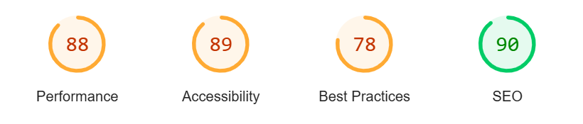
The Home Page (Mobile)      
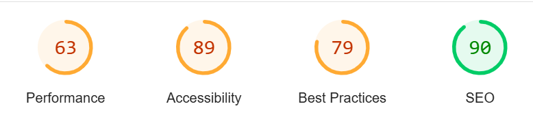    
The Products Page (Mobile)  
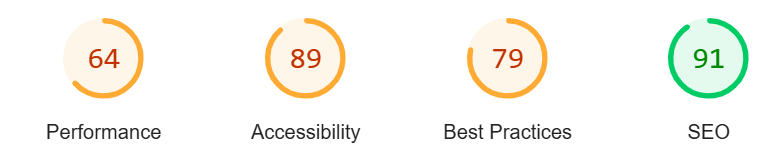    
The Contact Us Page (Desktop)  
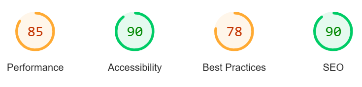     
The Articles Page (Desktop)    
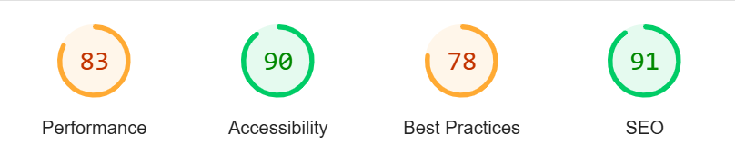     

### Browser Compatibility
I have tested compatibility on the following browsers. Safari, Chrome, Edge and Firefox.    

### Responsiveness
Responsive on all device sizes - This was checked using [Am I Responsive](https://ui.dev/amiresponsive) and by asking friends and family to test it on their devices. The devices checked included Samsung Galaxy, iPhone 8 and 10, iPad Air, Chromebook, Laptop and PC.    

### Code Validation
- **HTML**    
The [W3 HTML5](https://validator.w3.org/) validation tool was used. I validated each page by direct input and URI.  There were no errors or warnings to show.
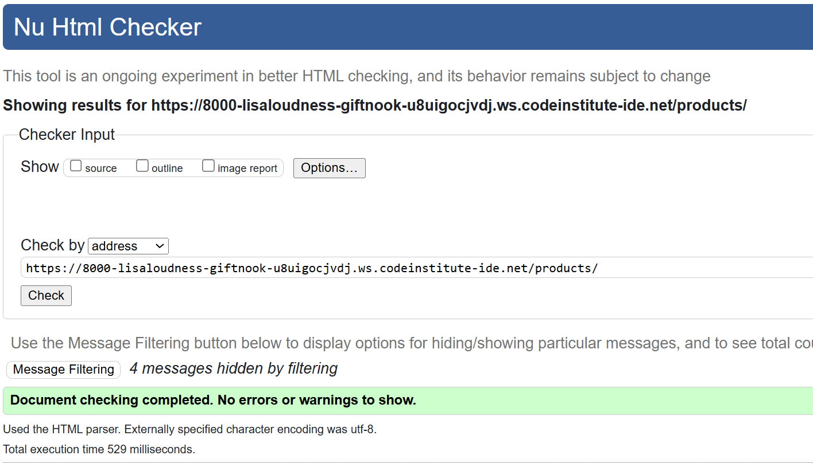              
- **CSS**    
The [W3 CSS](https://jigsaw.w3.org/css-validator/) validation tool was used. I validated by URI. No errors were found. 
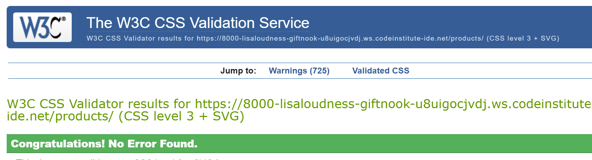
- **JS**    
The [jshint](https://www.jshint.com/) validation tool was used. There were errors relating to the use of $ but this was necessary for stripe initialisation so can be dismissed. No other syntax errors were identified.        
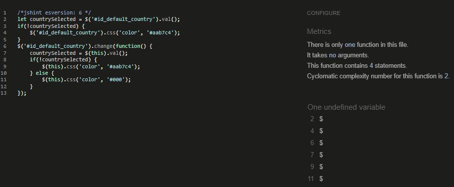
- **PYTHON**    
The [CI Python Linter](https://pep8ci.herokuapp.com/) validation tool was used. Flake8 error checking was used in my IDE throughout development. All custom python code was tested in the CI Python Linter and the results were all clear, no errors found.      
    
### Manual Testing user stories
I asked family, friends and work colleagues to test my site on their devices and report back any issues. This group encompassed a wide range of ages and abilities. I felt this gave me a fair representation of how my app would be used in a real world situation and the feedback was very useful.      
User Story |  Test | Pass
--- | --- | :---:
Unregistered user tries to log in | Flash message 'Not Yet Registered' and redirect to Register page | &check;
Registered user enters the incorrect password | Flash message 'Incorrect Password and/or Username' | &check;
User tries to create a username or password without the minimum number of characters | Helper text explains you need to use more characters | &check;
User tries to perform a search without entering a keyword | Helper text appears 'Please enter a search term' |  &check;
User performs a search with no results | Message 'No Products found for....' | &check;
Admin adds a product without an image | Placeholder image is displayed instead | &check;
User tries to edit/delete a review not created by them | Edit/Delete buttons are not available to them | &check;      

### Manual Testing features
| Status | feature
|:-------:|:--------|
| &check; | User can perform a search of the database
| &check; | User can send a message to admin via the contact us form
| &check; | User can add a product to the basket and adjust quantity or remove it
| &check; | User can progress to checkout and complete payment
| &check; | User can register successfully and has access to their profile page
| &check; | Registered User can view past orders
| &check; | Registered User can update personal details
| &check; | Registered User can add a review
| &check; | Registered User can delete their own review
| &check; | Registered User can log out
| &check; | Admin can add a product
| &check; | Admin can edit/delete products 
## Bugs
List of bugs and how I fixed them.
| Bug | Fix
|:-------:|:--------|
| FAQ image was not responsive  |  added class img-fluid to div |
| CSS was not displaying on deployed site  |  recreated AWS bucket keys |
| Products not appearing on deployed site  |  database url was incorrect in env.py |
| Contact Us app not connecting to database  |  deleted and remigrated |
## Deployment
This website is deployed to Heroku from a GitHub repository, the following steps were taken:

#### Creating Repository on GitHub
- First make sure you are signed into [Github](https://github.com/) and go to the code institutes template, which can be found [here](https://github.com/Code-Institute-Org/gitpod-full-template).
- Then click on **use this template** and select **Create a new repository** from the drop-down. Enter the name for the repository and click **Create repository from template**.
- Once the repository was created, I clicked the green **gitpod** button to create a workspace in gitpod so that I could write the code for the site.
  
#### Making a Local Clone
1. Log in to GitHub and locate the [GitHub Repository](https://github.com/lisaloudness/gift_nook)
2. Under the repository name, click "Clone or download".
3. To clone the repository using HTTPS, under "Clone with HTTPS", copy the link.
4. Open Git Bash
5. Change the current working directory to the location where you want the cloned directory to be made.
6. Type `git clone`, and then paste the URL you copied in Step 3.

```
$ git clone https://github.com/lisaloudness/gift_nook
```

7. Press Enter. Your local clone will be created.

```
$ git clone https://github.com/lisaloudness/gift_nook
> Cloning into `CI-Clone`...
> remote: Counting objects: 10, done.
> remote: Compressing objects: 100% (8/8), done.
> remove: Total 10 (delta 1), reused 10 (delta 1)
> Unpacking objects: 100% (10/10), done.
```

Click [Here](https://help.github.com/en/github/creating-cloning-and-archiving-repositories/cloning-a-repository#cloning-a-repository-to-github-desktop) to retrieve pictures for some of the buttons and more detailed explanations of the above process.

#### Forking the Github Repository 
By forking the GitHub Repository we make a copy of the original repository on our GitHub account to view and/or make changes without affecting the original repository by using the following steps...

1. Log in to GitHub and locate the [GitHub Repository](https://github.com/lisaloudness/gift_nook.git)
2. At the top of the Repository (not top of page) just above the "Settings" Button on the menu, locate the "Fork" Button.
3. You should now have a copy of the original repository in your GitHub account.

#### Creating an app on Heroku
- After creating the repository on GitHub, head over to [heroku](https://www.heroku.com/) and sign in.
- On the home page, click **New** and **Create new app** from the drop down.
- Give the app a name(this must be unique) and select a **region** I chose **Europe** as I am in Europe, Then click **Create app**.

#### Deploying to Heroku.
- In GitPod CLI, the root directory of the project, run: pip3 freeze --local > requirements.txt to create a requirements.txt file containing project dependencies.
- In the Gitpod project workspace root directory, create a new file called Procfile, with capital 'P'. Open the Procfile. - Inside the file, check that web: gunicorn giftnook.wsgi:application has been added when creating the file Save the file.
- Push the 2 new files to the GitHub repository
- Login to Heroku, select Create new app, add the name for your app and choose your closest region.
- Navigate to the Deploy tab on Heroku dashboard and select Github, search for your repository and click 'connect'.
- Navigate to the settings tab, click reveal config vars and input the following:


| Key | Value
|:-------:|:--------|
| AWS_ACCESS_KEY_ID  |    |
| AWS_SECRET_ACCESS_KEY  |    |
| DATABASE_URL  |    |
| EMAIL_HOST_PASS  |    |
| EMAIL_HOST_USER  |    |
| STRIPE_PUBLIC_KEY  |    |
| STRIPE_SECRET_KEY  |    |
| STRIPE_WH_SECRET  |    |
| USE_AWS  |    |
| SECRET_KEY   |     |

Actual Enviroment variables not disclosed for security

#### Amazon Web Services - AWS & Cloning Instructions

In this project for the storing of static files and images i used Amazon Web Services. The steps I took to achieve this are listed below. 

1. Open up [Amazon Web Services](https://aws.amazon.com/) in your browser
2. Click on Create AWS Account 
3. You will need to complete all of the required questions asked by Amazon during the sign in process relative to you.
4. Once registration is complete you can navigate to your AWS dashboard
5. I used Amazon S3 services, if its your first time on the dashboard the quickest way to find it is to type S3 into the search bar. 
6. When you select S3 you will see a button that says "Create Bucket", click this and give your bucket a name. Tip: Name your bucket something relevant to the project its associated with. You will also need to select the region closest to you in the drop down menu also on this page. 
7. Un-tick the box that says "Block all public access". AWS may give you a warning but you can ignore this as the static files need to be public. Now click the "Create bucket" button

> Go to bucket properties<br>
> Turn on static web hosting<br>
> in the index and error text inputs, add index.html and error.html and then save<br>

8. On the permissions tab in the CORS configuration section i used the code below.

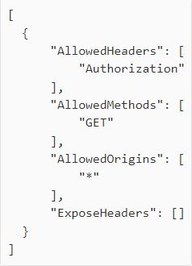


9. Now go to the bucket policy tab and select policy generator. I selected the following:<br>
> Type Of Policy: S3 bucket policy<br>
> From action drop down select: "get object"<br>
> You will be asked for your ARN, copy and paste it from the bucket policy page.<br>
> Click add statement<br>
> Then click on the generate policy button<br>
> Then copy and paste the new policy thats generated into your bucket policy<br>
> Be sure to add /* onto the end of the resources key<br>
> Click save.<br>
+
10. Now go to Access Control List, set list objects permission to everyone (Public)

11. We now ned to create a new group and user to access the bucket. Navigate back to the search page and type in the search box IAM (Identity Access Management) 
> Click create a new group and name it, a good one is manage-`insert project name here`<br>
> Click through the pages and click on the create group button<br>

12. Now we need ot create a group policy. Click on policies option in the menu and click on create policy
> Select the JSON tab and then import managed policies.
> search s3 and select on Amazons3fullaccess and import.
> In the resources section, paste in the ARN that we used previously. You will want to enter the ARN twice and at the end of the second one add a *

> Click through to review policy, give it a name and description and click generate policy

13. Now click on groups again from the side menu, select the group you had previously created, click attach policy, search for the policy we created using the search bar, and then click attach policy. 

14. Finally we need to create a user. Click users from the menu, click add user, create a user name, select programmatic access and click next. 

15. Select the group to add your user too, click through to the end and then click create user. Download the CSV file containing the user keys needed to access the app<br>
<strong>Warning: Do not share the keys from this CSV file with anyone or make them public by pushing them to your Github</strong><br><br>

#### Connect bucket to Django & Cloning Instructions

To connect Django to the bucket I followed the following steps. 

1. Install 2 new packages
`pip3 install boto3`
`pip3 install django-storages`

2. Again we need to freeze these so they are added to the requirements.txt file and deployed ot Heroku when we deploy
`pip3 freeze > requirements.txt`

3. In settings.py we will then need to add `storages` to the installed apps section.

4. An environment variable called USE_AWS needs to be set up to run the code on Heroku.

5. Now back in Heroku click on settings tab and then click reveal config vars, set up the environmental variables as required. USE_AWS should have a value of True.

6. At this point i also deleted the `DISABLE_COLLECTSTATIC` variable. 

7. Now back in Gitpod we need to create a custom_storages.py file to tell django that in production we want to use Amazon S3 to store our static and media files. The 2 custom classes we need ot use to action this is:

`class StaticStorage(S3Boto3Storage):`
&nbsp;&nbsp;`location = settings.STATICFILES_LOCATION`

`class MediaStorage(S3Boto3Storage):`
&nbsp;&nbsp;`location = settings.MEDIAFILES_LOCATION`

8. Now save, add, commit and push to Github for the above changes to take place.

#### Add Media files to AWS & Cloning Instructions

Finally we need to upload all the images to S3. To do this I followed the following steps:

1. Back on AWS in your AWS bucket, create a new folder called media
2. Select upload and then upload all your image folders and files. When uploading the files be sure to set the permissions to Everyone (Public access) 

#### Stripe & Cloning Instructions

The final step now is to add the stripe keys to the config variables. These values you can get from your stripe dashboard,. 
Remember all of your config vars need to match what you have in your settings.py file.

## Credits
### Code
- Code Institute Boutique Ado walkthrough used as the basis for my site. I then added the reviews and messages functionality.
- I found additional learning about Django here [Django Project](https://forum.djangoproject.com/)
- Creating reviews and ratings in Django [YouTube](https://www.youtube.com/watch?v=UgEVC7oJDHI)
- How to build an e-commerce site in Django [YouTube](https://www.youtube.com/watch?v=Y5vvGQyHtpM)
- How to add Product Reviews [Medium](https://medium.com/code-with-stein/product-reviews-how-to-build-an-ecommerce-website-using-django-3-and-vue-js-part-20-1ecc788a1603)
- How to make card images the same size as each other [Stack Overflow](https://stackoverflow.com/questions/37287153/how-to-get-images-in-bootstraps-card-to-be-the-same-height-width)
- Resetting db in Django by Farheen Shahid [Scaler.com](https://www.scaler.com/topics/django/resetting-db-in-django/)
- Creating a custom 404 page in Django [W3 Schools](https://www.w3schools.com/django/django_404.php)
### Content    
Product images sourced from LisaAngel. All text content created by myself. Website for educational purposes only.    

  
    
## Acknowledgments

- Tutor Support at Code Institute for continuous support and patience.


